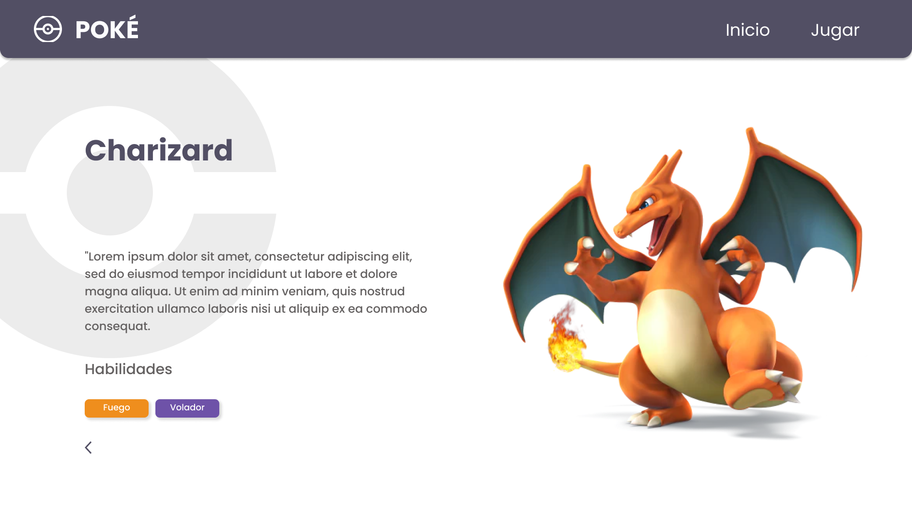
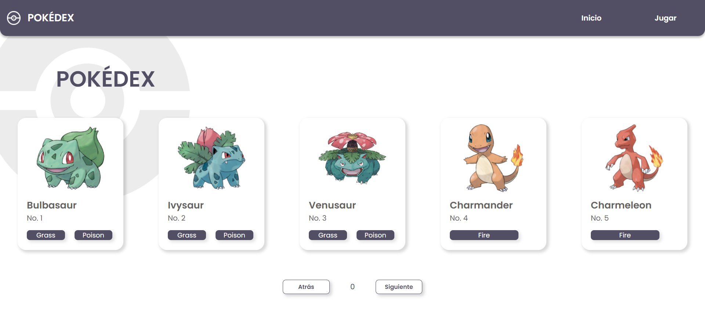

# Pokédex challenge

## Índice

* [1. Definición del producto](#1-definición-del-producto)
* [2. Prototipos](#2-prototipos)
* [3. Tecnologías y metodologías usadas](#3-tecnologías-y-metodologías-usadas)

## 1. Definición del producto

En esta actividad se desarrolló un proyecto en Vue que muestra un listado de pokémons traidos de una API y se muestra información relevante para simular una Pokédex. Este proyecto se logró desarrollar en 5 días con el framework de VUE, JavaScript y CSS. 

## 2. Prototipos

### Prototipos de alta fidelidad

Para asegurar una buena experiencia de usuario se realizaron prototipos de alta fidelidad de las pantallas que contiene la aplicación. Se tuvo en cuenta la accesibilidad relacionada con contraste, diseño y usabilidad.

[Ver prototipos de alta fidelidad](https://www.figma.com/file/VN8aYnQ5FRI6Ivv2UOycmK/PokeChallengeMockups?node-id=0%3A1)

### Restultado final

## 3. Tecnologías y metodologías usadas

### Metodologías

- **Proceso de desarrollo:** SCRUM para planeación de cada funcionalidad como historias de usuario.
- **Nombrado de clases:** Metodología BEM (Block, Element, Modifier).

### Tecnologías
- **Flujo de trabajo:** Se usó GitFlow con rama developer donde se subía un tag por funcionalidad.
- **Framework:** VUE JS.
- **Estilos:** Hoja de estilos CSS.