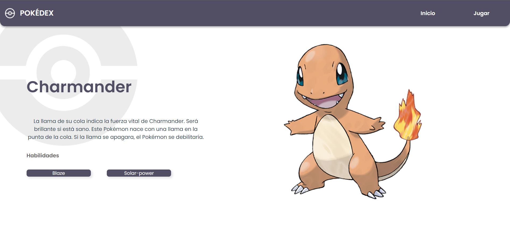

# Pokédex challenge

## Índice

* [1. Definición del producto](#1-definición-del-producto)
* [2. Prototipos](#2-prototipos)
* [3. Pasos para la solución](#3-pasos-para-la-solución)
* [4. Tecnologías y metodologías usadas](#4-tecnologías-y-metodologías-usadas)

## 1. Definición del producto

En esta actividad se desarrolló un proyecto en Vue que muestra un listado de pokémons traidos de una API y se muestra información relevante para simular una Pokédex. Este proyecto se logró desarrollar en 5 días con el framework de VUE, JavaScript y CSS. 

## 2. Prototipos

### Prototipos de alta fidelidad

Para asegurar una buena experiencia de usuario se realizaron prototipos de alta fidelidad de las pantallas que contiene la aplicación. Se tuvo en cuenta la accesibilidad relacionada con contraste, diseño y usabilidad.

[Ver prototipos de alta fidelidad](https://www.figma.com/file/VN8aYnQ5FRI6Ivv2UOycmK/PokeChallengeMockups?node-id=0%3A1)

### Restultado final

## 3. Pasos para la solución

 - [X] **1. Organización:** Para tener una vision clara del proyecto se empezó realizando un trello que contenía toda la información correspondiente al proyecto y la planeación por día de las actividades a realizar. De igual forma se revisaba diariamente para marcar tareas hechas y aquellas por terminar. 

[Ver planeación en trello](https://trello.com/b/dIxgDem7/tech-test)

 - [X] **2. Investigación:** Para desarrollar la aplicación se investigó temas relacionados con GitFlow, VUE JS, posibles librerias para estilos. El reto principal fue el desarrollo con VUE ya que la experiencia era baja. Sin embargo, buscando la documentación oficial y pidiendo ayuda de conocidos se logró aprender y desarrollar la app con este framework. 

 - [X] **3. Desarrollo:** De acuerdo a la organización se buscó lograr hacer una funcionalidad por día, pero, debido a algunas situaciones presentadas en el pretrabajo y el llamado de la data, se tuvieron que retrasar algunas tareas, por lo que el entregable final necesita algunas modificaciones relacionadas con carga de datos, paginación y funcionalidad para cambios de idioma. 

 - [X] **4. Recomendaciones:** Considero que el reto es muy adecuado para el tiempo en el que se plantea y a su vez es retador para quienes no tenemos tanta experiencia con el framework. Para mi ha sido un proceso de aprendizaje muy grande pues conocí la forma como se puede trabajar con Vue. Me gustaría que en retos futuros se pudiera recomendar alguna metodología o framework para realizar estilos, pues aunque busqué la forma de realizar el desarrollo con una libería, fue complejo encontrar una ideal para crear los estilos más modificables.  

## 4. Tecnologías y metodologías usadas

### Metodologías

- **Proceso de desarrollo:** SCRUM para planeación de cada funcionalidad como historias de usuario.
- **Nombrado de clases:** Metodología BEM (Block, Element, Modifier).

### Tecnologías
- **Flujo de trabajo:** Se usó GitFlow con rama developer donde se subía un tag por funcionalidad.
- **Framework:** VUE JS.
- **Estilos:** Hoja de estilos CSS.